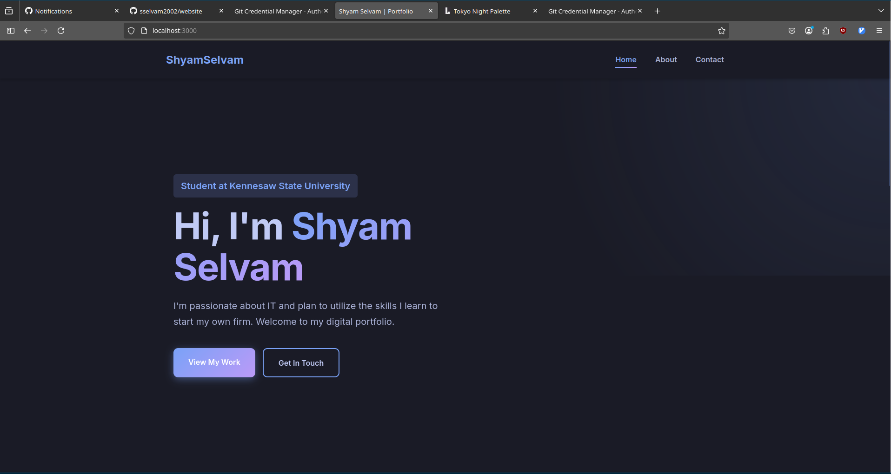
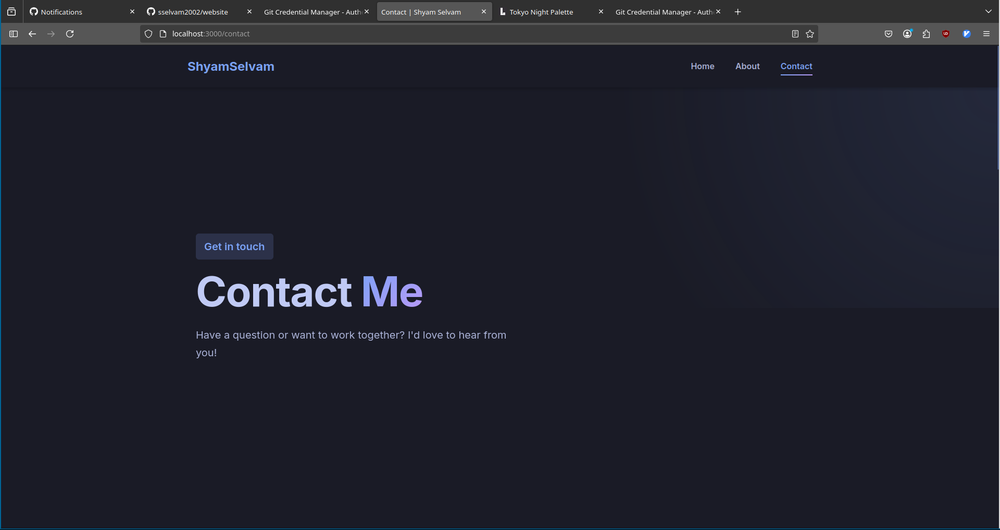

# Portfolio

## A modern, interactive website portfolio.



This is my own portfolio done with the standard html css and javascript with node express.

## Features

- **Rich UI:** font awesome with nerd Icons and tokyo night colorscheme.
- **Interactivity:** Interactive with javascript.
- **Express** Used express and node for routing.

---

## Requirements

- [nodejs](https://nodejs.org/en/download)
- [express](https://www.npmjs.com/package/express)
- [font awesome](https://cdnjs.cloudflare.com/ajax/libs/font-awesome/6.5.1/css/all.min.css)
- [tokyo night](https://lospec.com/palette-list/tokyo-night)

## Installation

1. Install dependencies (if not already installed):
2. clone the repo:

```sh
git clone https://github.com/sselvam2002/website
```

3. Install project dependency:

```sh
npm install
```

4. Run the project:

```sh
node app.js
```

## License

This project is licensed under the MIT License. See the [LICENSE](./LICENSE) file for details.
